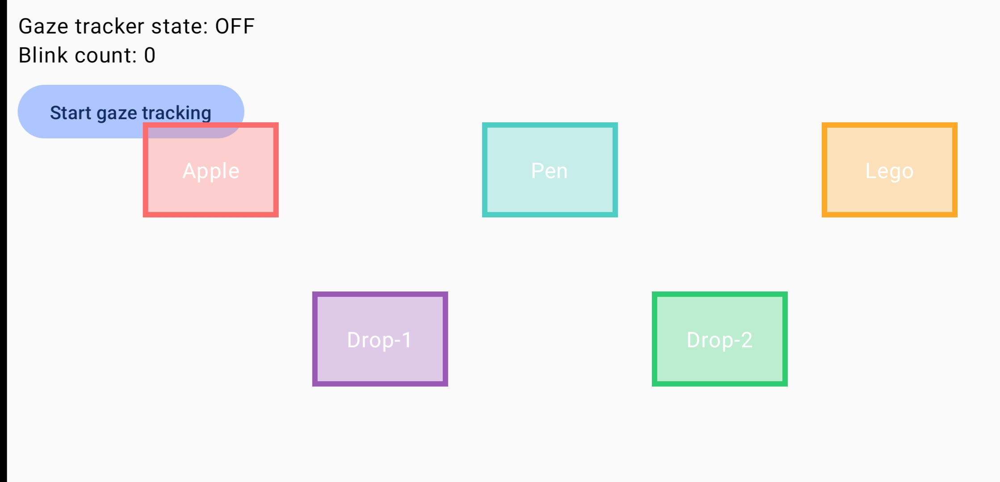
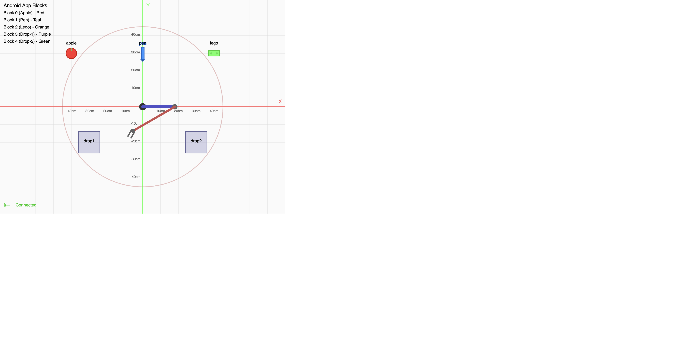

# Gaze-Grasper

This project is a simulation of a wearable robotic arm that can be controlled by a user's gaze and facial expressions, or by clicking on objects in the web-based visualization. It allows users to reach for, grasp, release, and manipulate objects in a virtual environment.

## Screenshots

### Android App Interface

*The Android app with gaze tracking calibration and interactive blocks*

### Web Visualization

*Real-time 2D visualization of the robotic arm with interactive objects and drop zones*

### System in Action

*Complete Gaze-Grasper system showing gaze-controlled object manipulation*

## How It Works - System Pipeline

The Gaze-Grasper system follows this data flow pipeline:

```
┌─────────────────────────────────────────────────────────────────┐
│                        USER INTERACTION                          │
│  (Gaze tracking + Blink detection OR Web-based click)           │
└────────────────────┬────────────────────────────────────────────┘
                     │
                     ▼
    ┌────────────────────────────────────────────┐
    │      Android App (Port: Client)            │
    │  • SeeSo Gaze Tracker SDK                  │
    │  • 5 Interactive Blocks (0-4)              │
    │  • Gaze + 3 blinks OR Direct tap           │
    │  • Sends HTTP POST to controller           │
    └────────────────┬───────────────────────────┘
                     │
                     │ HTTP POST: {"block_id": 0-4}
                     │ Endpoint: /arm/move
                     ▼
    ┌────────────────────────────────────────────┐
    │   Robot Arm Controller (Port: 5001)        │
    │  • Flask REST API Server                   │
    │  • Inverse Kinematics Engine               │
    │  • Virtual Arm State Manager               │
    │  • Object & Drop Zone Manager              │
    │  • Block ID → Position Mapping:            │
    │    - Block 0: Apple (right pick)           │
    │    - Block 1: Pen (center pick)            │
    │    - Block 2: Lego (left pick)             │
    │    - Block 3: Drop Zone 1 (center)         │
    │    - Block 4: Drop Zone 2 (right)          │
    └────────────────┬───────────────────────────┘
                     │
                     │ WebSocket/HTTP GET: /arm/state
                     │ Updates: motor_positions, held_object, objects
                     ▼
    ┌────────────────────────────────────────────┐
    │   Visualization Frontend (Port: 8000)      │
    │  • HTML5 Canvas Rendering                  │
    │  • Real-time arm visualization             │
    │  • Interactive object clicking             │
    │  • Polls controller for state updates      │
    └────────────────────────────────────────────┘
```

### Detailed Flow:

1. **Input Layer** (Android App OR Web Interface):
   - **Gaze-based**: User looks at a colored block and blinks 3 times rapidly
   - **Touch-based**: User taps directly on a block in the Android app
   - **Click-based**: User clicks on objects/drop zones in the web visualization
   - Block IDs (0-4) map to specific objects or drop zones

2. **Control Layer** (Robot Arm Controller):
   - Receives `{"block_id": X}` via HTTP POST to `/arm/move`
   - Maps block ID to 3D target position `[x, y, z]`
   - Computes inverse kinematics to calculate joint angles
   - Updates virtual arm state (motor positions, object holding status)
   - Manages object pickup and drop logic
   - Exposes state via GET `/arm/state` endpoint

3. **Visualization Layer** (Web Frontend):
   - Continuously polls `/arm/state` for updates
   - Renders 2D representation of the robot arm using Canvas API
   - Shows real-time arm movement and object interactions
   - Allows direct control by clicking on objects

### Network Requirements:
- All components must be on the **same Wi-Fi network**
- Android app connects to controller at `http://<COMPUTER_IP>:5001`
- Web visualization connects to `http://localhost:5001` (or remote IP)

## Components

The Gaze-Grasper project is divided into three main components:

1.  **Android App (`./android-app/`)**: The main user interface for the project. It runs on an Android device and is responsible for tracking the user's gaze and facial expressions. This information is then used to control the simulated robotic arm. For more information, see the [Android App README](./android-app/README.md).

2.  **Robot Arm Controller (`./robot-arm-controller/`)**: This component is the controlling instance for the simulated wearable robotic arm. It is written in Python and runs a web server that receives commands from the Android app or the web-based controller to control the arm's movements. For more details, refer to the [Robot Arm Controller README](./robot-arm-controller/README.md).

3.  **Visualization Frontend (`./visualization-frontend/`)**: A web-based application that provides a 2D visualization of the simulated robot arm and its environment. It communicates with the robot arm controller to display the arm's movements in real-time. It also includes a web-based controller that allows you to control the arm by clicking on objects and drop zones. For more information, see the [Visualization Frontend README](./visualization-frontend/README.md).

## Getting Started

To get started with the Gaze-Grasper project, you will need to set up each of the components individually. Please refer to the README file in each component's directory for specific setup instructions.
